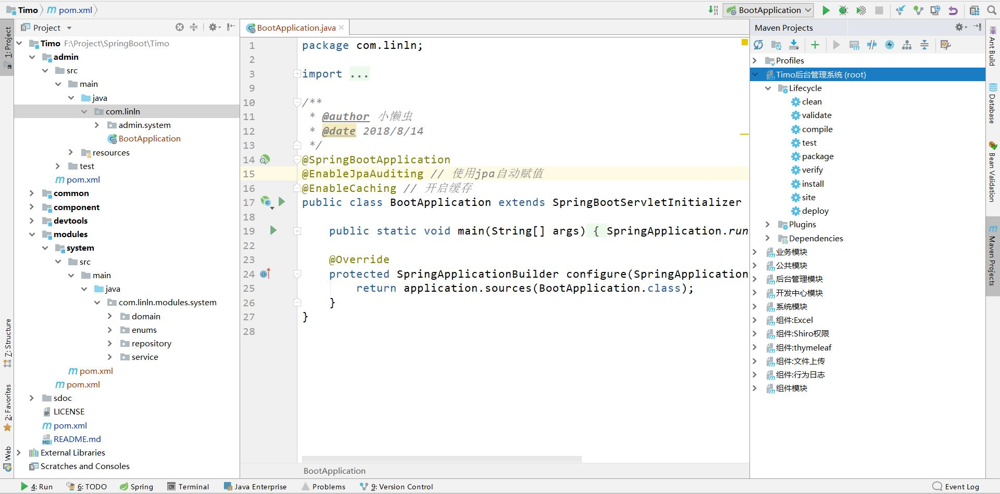
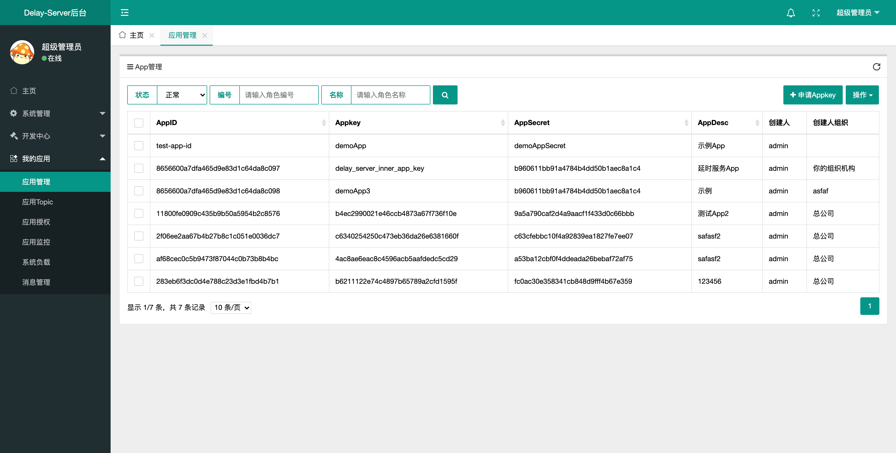
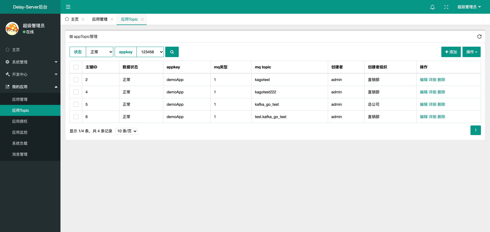
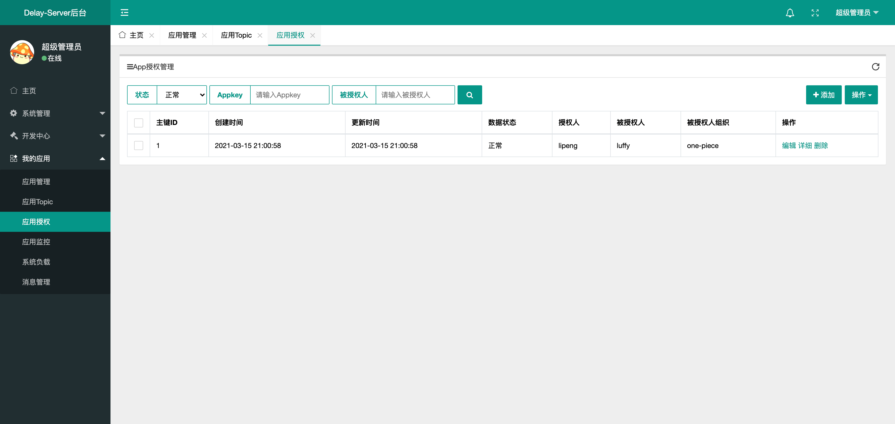
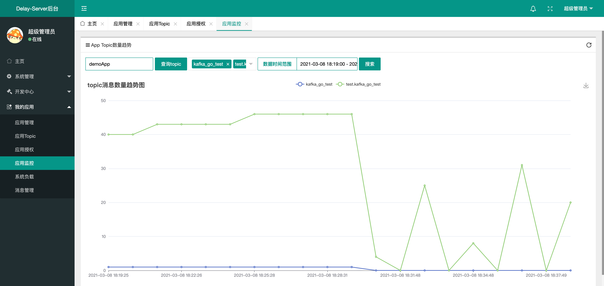

# Delay-Server-UI v1.0.0

 
#### 项目介绍

Delay-Server后台管理系统，基于SpringBoot2.0 + Spring Data Jpa + Thymeleaf + Shiro 开发的后台管理系统，采用分模块的方式便于开发和维护，目前支持的功能有：权限管理、部门管理、字典管理、日志记录、文件上传、代码生成等，为快速开发后台系统而生的脚手架！      
开源协议：Apache License 2.0      
基于Timo项目改造，地址：https://gitee.com/aun/Timo      

#### 技术选型

- 后端技术：SpringBoot + Spring Data Jpa + Thymeleaf + Shiro + Jwt + EhCache

- 前端技术：Layui + Jquery  + zTree + Font-awesome

#### 全新的项目结构

#### 功能列表

##### 业务功能   
- 应用管理，分配查询appkey</li>
- 应用Topic，针对appkey，进行分配和查询topic</li>
- 应用授权，针对Appkey，把自己所属的appkey授权给其他人</li>
- 应用监控，查询消息数量，消息走势图</li>
##### 基础功能   
- 用户管理：用于管理后台系统的用户，可进行增删改查等操作。
- 角色管理：分配权限的最小单元，通过角色给用户分配权限。
- 菜单管理：用于配置系统菜单，同时也作为权限资源。
- 部门管理：通过不同的部门来管理和区分用户。
- 字典管理：对一些需要转换的数据进行统一管理，如：男、女等。
- 行为日志：用于记录用户对系统的操作，同时监视系统运行时发生的错误。
- 文件上传：内置了文件上传接口，方便开发者使用文件上传功能。
- 代码生成：可以帮助开发者快速开发项目，减少不必要的重复操作，花更多精力注重业务实现。
- 表单构建：通过拖拽的方式快速构建一个表单模块。
- 数据接口：根据业务代码自动生成相关的api接口文档

#### 安装教程

- ##### 环境及插件要求

   - Jdk8+
   - Mysql5.5+
   - Maven
   - Lombok（重要）

- ##### 导入项目

   - IntelliJ IDEA：Import Project -> Import Project from external model -> Maven
   - Eclipse：Import -> Exising Mavne Project

- ##### 运行项目

  - 通过Java应用方式运行admin模块下的BootApplication.java文件
  - 数据库配置：数据库名称delay-server   用户root    密码root
  - 访问地址：http://localhost:8080/
  - 默认帐号密码：admin/123456

#### 使用说明

1. 使用文档：sdoc/使用文档.docx    
2. SQL文件：sdoc/delay-server-ui.sql    
3. 系统已经内建了应用接入方角色，新加的用户可以分配这个角色     

#### TODO    
1. 有些功能细则待完善  
2. 系统负载和消息管理页面开发中   

#### 预览图

<!-- 

;

;

;

;

;

;
-->